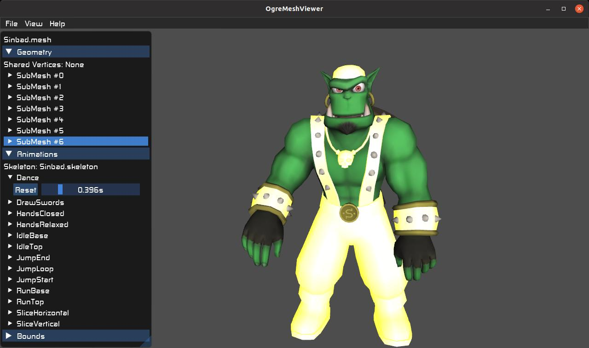

# ogre-meshviewer

Viewer for `.mesh` model files as consumed by OGRE



# features
* display mesh properties (bounds, referenced materials)
* highlight submeshes in 3D view
* preview linked animations (skeleton and vertex)
* easy to use UI

# usage
Double click on `.mesh` in file browser or use the CLI as

```
ogre-meshviewer [-h] [-c RESCFG] meshfile
```
where `meshfile` can be either an absolute path or a resource name referenced in RESCFG.

# dependencies
* ogre 1.11.5+
* ogre-imgui
* python3

# download
[](https://snapcraft.io/ogre-meshviewer)
